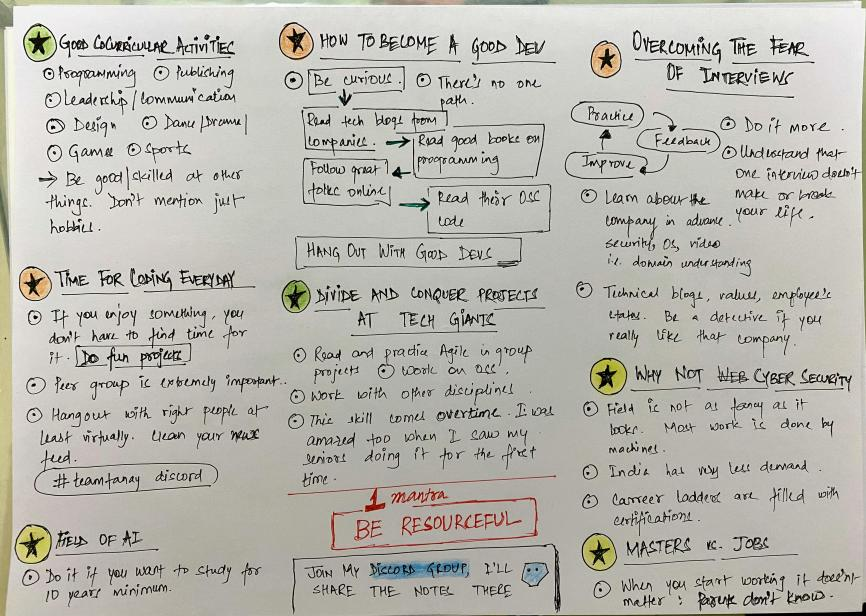

# RoadMap-to-Mastery


### Some Books
- https://github.com/PrajjwalDatir/books-1
### Tips
1.  To everyone who is having trouble  hosting your code online, here is an easy hack to host your website in 10 seconds. 

    in your repo link, change github.com to githubbox.com

    example from 

    https://github.com/PrajjwalDatir/my_profile

    to 

    https://githubbox.com/PrajjwalDatir/my_profile

    it will host your whole code in an online editor -> https://codesandbox.io

2. [My Web Development Library - Youtube]() 

3. [This](https://discord.com/channels/713418735532114034/713450850625781771) Discord channel has lot of good resources.


### Curriculum Guide CS Btech
    - Geeksforgeeks
    - TutorialsPoint

### DBMS Guide
- [Database by InternLabs](https://github.com/internlabs/database)

### CP Guide
- [All CP Algorithms](https://cp-algorithms.com/)
- [cses problem set](https://cses.fi/problemset/)

- Practice sites :
    **Follow me XD if you find this guide helpful**
    - [Leetcode](https://leetcode.com/prajjwaldatir/)
    - [Codeforces](https://codeforces.com/siriusxmaniac)
    - [Codechef](https://www.codechef.com/siriusxmaniac)
    - [Hackerrank](https://www.hackerrank.com/prajjwal_coep)
    - [Interviewbit](https://www.interviewbit.com/profile/prajjwal-datir)

### DSA Guide
- [Geeksforgeeks](https://www.geeksforgeeks.org/)
- [TutorialsPoint Library](https://www.tutorialspoint.com/tutorialslibrary.htm)
- [DSA by InternLabs](https://github.com/internlabs/dsa)
### Interview Guide
- [Practice this to get into FAANG (Fb, Apple, Amazon, Netflix, Google)](https://github.com/jwasham/coding-interview-university)
### Web Development Guide

- [ Web Dev Setup ](https://codingphase.teachable.com/courses/enrolled/328397)

- **Common**
    - [x] HTML
    - [x] CSS
    - [x] Bootstrap
    - [ ] apache server
- **Python3**
    - [x] Python3
    - [ ] Flask
    - [ ] Django
- **Javascript**
    - [ ] Javascript
    - [ ] Typescript
    - [ ] MERN
        - [ ] MongoDB
        - [ ] Express.js
        - [ ] React.js
            - ### Source :
            1. [Basics of React in 10-20min](https://medium.com/@madhupathy/learn-basics-of-react-js-in-3-minutes-a94cbc6f02c8)

            2. [Roadmap to React via FreeCodeCamp](https://www.freecodecamp.org/news/learning-react-roadmap-from-scratch-to-advanced-bff7735531b6/)

            3. [Learn React js via RobinWieruch](https://www.robinwieruch.de/learn-react-js)

        - [ ] Node.js
            - ### Source :

            1. [Node based Practices (github blog)](https://github.com/goldbergyoni/nodebestpractices)

    - [ ] MEAN
- **Php**
    - [ ] Php
    - [ ] phpmyadmin
    - [ ] XAMPP
    - [ ] LAMP
    - [ ] Laravel 
        - ### source:

        1. [TutorialsPoint](https://www.tutorialspoint.com/laravel/index.html)
- **Wordpress**
    - [ ] Wordpress
    - [ ] Wordpress plugins


- #### Learn Javascript (Legendary)


- #### MERN Development Guide
    1. [Node based Practices (github blog)](https://github.com/goldbergyoni/nodebestpractices)
    
    2. [Roadmap to React via FreeCodeCamp](https://www.freecodecamp.org/news/learning-react-roadmap-from-scratch-to-advanced-bff7735531b6/)

    3. [Learn React js via RobinWieruch](https://www.robinwieruch.de/learn-react-js)

    4. [Mern Stack A-Z part 1 dev.<span>to](https://dev.to/bnevilleoneill/mern-stack-a-to-z-part-1-564j)

    5. [Mern Stack A-Z part 2 dev.<span>to](https://dev.to/bnevilleoneill/mern-stack-a-to-z-part-2-26pi)


- #### MEAN Development Guide


- #### LAMP Development Guide


- #### Wordpress Developement Guide

- #### Learn Typescript (Legendary)

***

### My personlity Guide
- Check your personlity according to ``www16personalities.com`` </br> Here's what I got ---> [https://www.16personalities.com/infj-personality](https://www.16personalities.com/infj-personality)

- Some Good Courses
    - [ ] [send-professional-emails By Google](https://learndigital.withgoogle.com/digitalgarage/course/send-professional-emails)

    - [ ] 
<!-- 
    - [ ]  -->

***

### LinkedIn

```
Respected Ma'am,
I am Prajjwal Datir, currently pursuing 3rd year Btech in Computer Engineering from College Of Engineering, Pune. I am currently looking for Summer internship, 
     I am an enthusiastic learner who constantly tries to learn new skills. I am proficient in DS and Algo with a fair amount of practice in it. I have had programming practice in languages like python, C++, C,  and Javascript. I have done some projects and am willing to work in web development domain. I have also worked on some frameworks Flask, Node.js, MySql (Database) and I am willing to adapt to the company's requirements. I would be very grateful if you give me a referral in your company for an internship. I would love to contribute towards reaching the goal of the company as well as honing my skills.

I can attach my resume for your reference, for more insights about my technical and extra curricular skills. Do let me know what do you think about this. 

Thanks and regards, 
Prajjwal Datir
```

```
Hey Xyz,

I really appreciate you connecting with me.

I wanted to share 3 quick things about myself  -

- I'm really into Web development and Finding solutions to everyday problems using Code, which has lead me to create an "oneforall" bash script few projects and also learn Py, Bash, JS, Flask, Node.js, etc. Currently I'm exploring more about MERN and learning as much as possible while persuing my CS grad.

- pick a thing from that person's bio and write something related.

- I love fiddling around various Operating Systems and Different DEs.

Would love to know what you are upto :)

Cheers!
```
### Discord Bot Guide:
_Thanks to **sentdex**_

Tutorial by Harrison - for doubts ->
Contact: Harrison@pythonprogramming.net.

- [ ] Basic discord
- [ ] Little Advanced
- [ ] Timing Bot Actions
- [ ] Embedding and ATtaching w/ Image Example
- [Basic Discord bot intro](https://pythonprogramming.net/discordpy-basic-bot-tutorial-introduction/)
    - Python library ``discordpy``
    - **Docs**
        - https://discordpy.readthedocs.io/en/rewrite/api.html#
        - https://discordapp.com/developers/applications/
    - Video recommended : [Intro to Discord Bot](https://youtu.be/ELUxJsQK290)
- [Little Advanced Bot](https://pythonprogramming.net/building-bot-commands-discordpy-bot-tutorial/)
    - **Docs** :
        - https://discordpy.readthedocs.io/en/rewrite/api.html#guild
    - Video recommended : [Building out Bot commands](https://youtu.be/I3xQcBwjXPc)
- [Timing Bot Actions](https://pythonprogramming.net/timing-actions-discordpy-bot-tutorial/)
    - Video recommended : [Timing bot actions](https://youtu.be/lrwwN31QxPw)
- [Embedding and Attaching w/ Image Example](https://pythonprogramming.net/attaching-files-images-embed-discordpy-bot-tutorial/)
    - Video recommended : [Embedding and Attaching w/ Image Example](https://youtu.be/MJDjVcfm-r0)

### TODO ( Personal - others may ignore )

1. https://applieddigitalskills.withgoogle.com/c/college-and-continuing-education-uk/en-uk/send-professional-emails/send-professional-emails/introduction-to-send-professional-emails.html#

2. http://foss.coep.org.in/coepwiki/index.php/HTTP_Server_Project

3. https://github.com/internlabs/dsa

4. https://github.com/internlabs/database